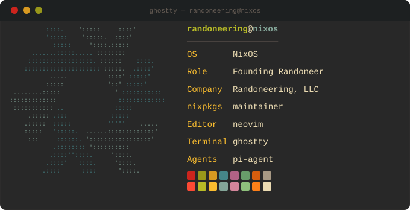

----

I run a fractional infrastructure engineering consultancy for startups and small businesses. 
- 🐘 PostgreSQL is life
- 🏳️‍🌈 Ally
- Building infrastructure automation, random terminal tools, and occasionally staring at a terminal config for two hours to get the colors exactly right is my bread and butter
- Also open source, because someone has to

Looking for someone to build out your infrastructure --->[randoneering.tech](https://randoneering.tech)

---
### Kaneo

I'm a core team member of [Kaneo](https://kaneo.app), an open source project management tool that stays out of your way. I keep the cloud infrastructure running, help with deployment, and chip in wherever else the team needs a hand.

[→ usekaneo/kaneo](https://github.com/usekaneo/kaneo)

[→ kaneo.app](https://kaneo.app)

### pgFirstAid

A PostgreSQL function that returns a prioritized list of what's actually wrong with your database. No agent to install, no SaaS to sign up for. Inspired by SQL Server's FirstResponderKit, built for the rest of us.

[→ randoneering/pgFirstAid](https://github.com/randoneering/pgFirstAid)

[→ website](https://pgfirstaid.com)

### nixpkgs maintainer

I keep a handful of packages up to date in [nixpkgs](https://github.com/NixOS/nixpkgs):

- [silo](https://search.nixos.org/packages?query=silo)
- [neon-cli](https://search.nixos.org/packages?query=neon-cli) (still in PR)
- [fresh-editor](https://search.nixos.org/packages?query=fresh-editor)
- [atuin-desktop](https://search.nixos.org/packages?query=atuin-desktop) (now archived)

### Notables

- **SCALE 23x speaker** - spoke on "Five Stages of Grieving: Databases in Infrastructure as Code" and "pgFirstAid"
- **Coder Radio 647** - guest on Coder Radio talking about pgFirstAid → [coder](https://coder.show/647)
- **Hacker News** - pgFirstAid hit the front page → [hn](https://news.ycombinator.com/item?id=45944951)
- **TLDR newsletter** - pgFirstAid was mentioned in the TLDR newsletter → [tldr](https://tldr.tech/data/2025-11-20)
- **Randoneering, LLC** - fractional infrastructure engineering consultancy out of the Gem State → [randoneering.tech](https://randoneering.tech)

---

### Stack

---

### Writing
- [The S76 Laptop Review No One Asked For](https://blog.randoneering.dev/blog/3mq66jfp63x23)
- [A Month Without Frontier Models](https://blog.randoneering.dev/blog/3mpd2raacd323)
- [pgFirstAid - hits 500 stars](https://randoneering.tech/blog/pgfirstaid/500stars)
- [The World We Live In](https://randoneering.tech/blog/random/theworldwelivein)
- [pgFirstAid - Milestone 2 and 3!](https://randoneering.tech/blog/pgfirstaid/pgfirstaid_m3)
- [Not Another AI Hype Train](https://randoneering.tech/blog/random/aihypetrain)
